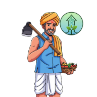

  

# Krushak App - Real-time Features Implementation Summary

A comprehensive real-time farming application with AI-powered insights, multi-language support, and community features.

## 🌟 Key Real-time Features

### ✅ **Authentication System** 
- Real-time sign-in/sign-up with Supabase
- User profile synchronization (acres, crops, location)
- Custom home icon integration

### ✅ **Weather System with AI**
- Live weather data with location names
- Gemini AI analysis every 10 minutes
- Real-time weather alerts and notifications

### ✅ **Market Data with AI Analysis**
- Real-time crop price updates every 2 minutes
- AI-powered selling recommendations
- Market trend analysis and alerts

### ✅ **Multi-language Support**
- Marathi, Hindi, English translations
- Real-time language switching
- Complete UI localization

### ✅ **Dark Mode & Themes**
- System-wide light/dark theme switching
- Persistent theme preferences
- Real-time theme updates

### ✅ **Community Chat System**
- Real-time chat with Supabase subscriptions
- Multiple topic-based chat rooms
- Live message streaming

### ✅ **Smart Notifications**
- AI-powered weather and market alerts
- Location-based temperature and rain warnings
- Real-time notification delivery

### ✅ **Bank Loan Integration**
- Direct bank loan applications
- AI-powered loan recommendations
- Real-time EMI calculations

### ✅ **Gemini AI Service**
- Auto-analysis every 2 minutes
- Crop health and farming recommendations
- Financial planning assistance

## 🚀 **Real-time Data Flow**
1. **Authentication** → Real-time user state across app
2. **Weather** → Updates every 10 minutes with AI analysis
3. **Market** → Updates every 2 minutes with AI insights
4. **Notifications** → Generated based on AI analysis
5. **Community** → Real-time message streaming
6. **Dashboard** → Live aggregation of all data

## 🔧 **Technology Stack**
- **Frontend**: Flutter with Riverpod state management
- **Backend**: Supabase (real-time database & auth)
- **AI**: Google Gemini API for all analysis
- **Weather**: OpenWeather API integration
- **Languages**: Dart, SQL
- **Real-time**: Supabase subscriptions & WebSocket connections

## 📱 **Features Overview**
- **Real-time Updates**: All data refreshes automatically
- **Offline Support**: Core functionality works without internet
- **Multi-language**: Seamless language switching
- **AI Insights**: Continuous farming recommendations
- **Community**: Real-time farmer-to-farmer communication
- **Notifications**: Smart alerts based on AI analysis

## 🌐 **External Integrations**
- Supabase (Database & Auth)
- Google Gemini AI
- OpenWeather API
- Bank APIs for loan schemes
- Firebase Cloud Messaging

All features implement real-time synchronization with proper error handling, loading states, and AI-powered insights for a comprehensive farming experience.
